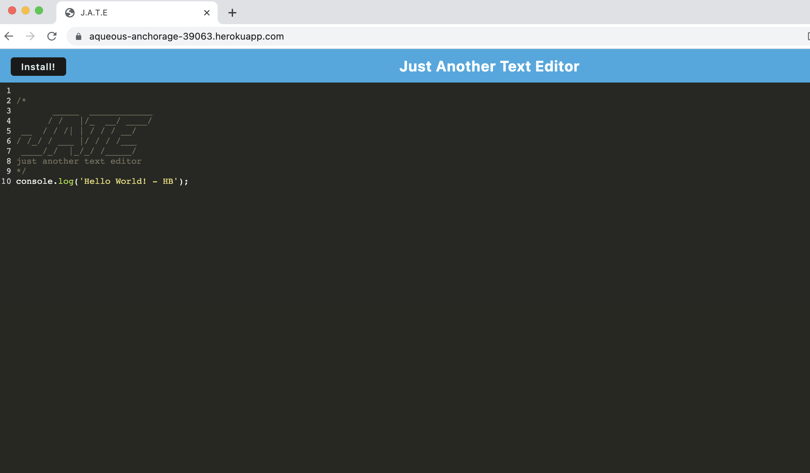

# Text-Editor

## Description

- The purpose of this repository is for a developer to create notes or code snippets with or without an internet connection
so that they can reliably retrieve them for later use.
- This is done by building a text editor that runs in the browser. The app is a single-page application that meets the Progressive Web Applications (PWA) criteria. Additionally, it features a number of data persistence techniques that serve as redundancy in case one of the options is not supported by the browser. The application also functions offline.

## Usage

- [Click here](https://*.herokuapp.com/) to navigate to the live link of this repository.

---------------------------

- Screenshots

---------------------------

## Credit

### Resources :books:
- Bootcamp Materials
- Demonstration by TA in class
- Starter code and files/folders have been provided.
- Tutor

### Assets :sparkles:
- [idb](https://www.npmjs.com/package/idb) Package

### Applications Used :gear:
- VS Code
- Heroku

Thank you for visiting! :ribbon:

