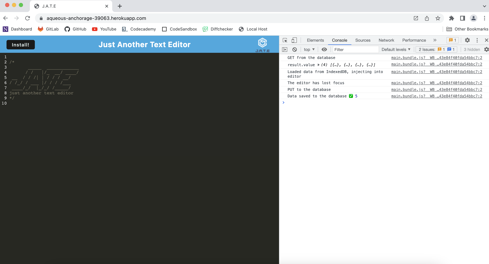

# Text-Editor

## Description

- The purpose of this repository is for a developer to create notes or code snippets with or without an internet connection
so that they can reliably retrieve them for later use.
- This is done by building a text editor that runs in the browser. The app is a single-page application that meets the Progressive Web Applications (PWA) criteria. Additionally, it features a number of data persistence techniques that serve as redundancy in case one of the options is not supported by the browser. The application also functions offline.

## Usage

- [Click here](https://aqueous-anchorage-39063.herokuapp.com/) to navigate to the live link of this repository.

---------------------------

- You are presented with the text editor:

- No errors in console log:

---------------------------

- Manifest information:

- No errors in Service Workers:

In browser, input is saved into *jate* IndexedDB database:

---------------------------

- When you click install, you will be presented with a confirmation:

- If you click install, applicaition is installed in your machine:

---------------------------

- In the downloaded appliaction, input is saved into *jate* IndexedDB database:

---------------------------

## Credit

### Resources :books:
- Bootcamp Materials
- Unit 19-PWA: *28-Stu_Mini-Project* and *26-Stu_Manifest*
- Demonstration by TA in class
- Starter code and files/folders have been provided.
- Tutor

### Assets :sparkles:

List of all packages used in this application from [npm](https://www.npmjs.com/):

***Root* Packages**

Dependencies:
- express
- if-env

devDependencies:
- concurrently
- nodemon

***Server* Packages**

Dependencies:
- express

devDependencies:
- nodemon

***Client* Packages**

Dependencies:
- code-mirror-themes
- idb

devDependencies:
- @babel/core
- @babel/plugin-transform-runtime
- @babel/preset-env
- @babel/runtime"
- babel-loader
- css-loader
- html-webpack-plugin
- http-server
- style-loader
- webpack
- webpack-cli
- webpack-dev-server
- webpack-pwa-manifest
- workbox-webpack-plugin

### Applications Used :gear:
- VS Code
- Heroku

Thank you for visiting! :ribbon:

